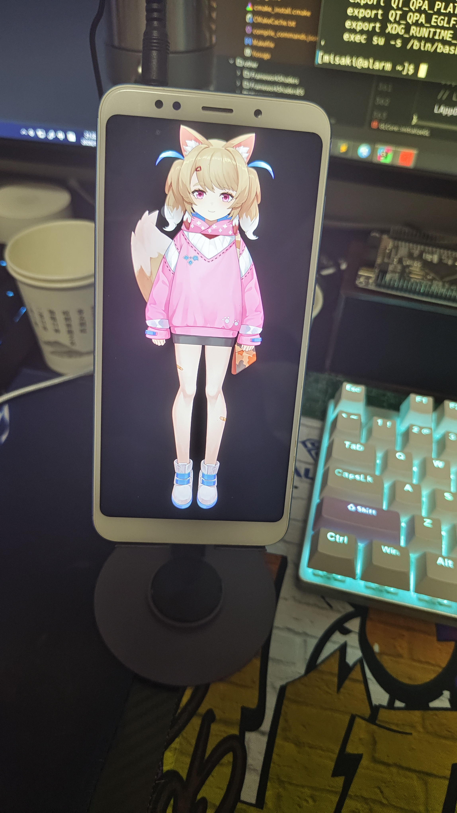

## 📊 Project Stats


欢迎访问本项目。

首先向你介绍一下Yosuga这个项目：

本项目的作者是Misakiotoha(みさきおとは[見崎音羽])。[call me "Misaki" でいいよ]

之所以叫Yosuga，这个词来源日语当中的单词"縁"的发音，其意思是"缘分，关系"。

本项目分为三个部分：
1. Yosuga：这是项目的前端部分，是Yosuga与用户交互的一层，采用C++20 + Qt6.6.3编写，使用到的核心外部库为Live2D For C++ SDK。
2. Yosuga_server：这是项目的后端部分，是Yosuga的核心，采用python3.11编写，使用到的外部库较多，负责联系项目的各个部分。
3. Yosuga_embedded：这是项目的拓展部分，使得Yosuga对嵌入式设备拥有几乎完全的自定义控制能力，采用C语言编写，只使用到了cJSON库，平台无关，增强了Yosuga与外界的交互能力。

_**本项目为Yosuga.**_

本项目使用CMake构建，基于C++Qt6.6.3以及Live2D官方SDK(CubismSdkForNative-5-r.4.1)实现Live2D桌面助手
(本项目由[Yosuga-qt5](https://github.com/Misakityan/Yosuga-qt5) 发展更新而来，项目架构与代码都有所不同，最显著的特点是本项目支持多平台)

本项目开发环境为:

- cmake version 3.5

- C++ 20

- Qt6.6.3

- IDE: Clion

如何构建本项目：

1.Install latest CMake(安装最新版本的CMake) or Install Clion(或者安装Clion,更推荐安装Clion,Clion捆绑了CMake)

2.gti clone https://github.com/Misakityan/Yosuga (克隆本项目)

3.Open with Clion(使用Clion打开本项目(推荐)) or use command(或者使用命令)

```powershell
# 创建构建目录
mkdir build
cd build

# 配置 CMake ,注意此处需要指定默认生成的为mingw的makefile文件
cmake ..

# 编译项目
make
```

注意：本项目只是Yosuga的客户端部分，完整的还包括服务端和嵌入式端
- 服务端项目地址见：https://github.com/Misakityan/Yosuga_server
- 嵌入式项目地址见：https://github.com/Misakityan/Yosuga_embedded

当前支持平台(已测试过的)：
-    Windows:    Windows 10
-    Linux:      kUbuntu 24.04
-    Linux ARM:  RK3566, Xiaomi Redmi 5 Plus

相关教程见BiliBili：https://www.bilibili.com/video/BV1TtkHYpEDA/?spm_id_from=333.1387.homepage.video_card.click&vd_source=d66e155c7b27c10078bc67965ea1989e

实现效果：

- 主机平台：
<div align="center">
    
</div>
<div align="center">
    
</div>

- 嵌入式Linux平台：
<div align="center">
    
</div>

关于授权 <br>
本项目采用多重授权结构：

1. 原创代码部分：MIT License <br>
   src/*.*

2. 依赖库：
    - Qt 6.6.3：LGPLv3 License
      （提供源码获取方式：https://www.qt.io/download）
       Qt部分采用动态链接方式
    - Live2D Cubism SDK：Live2D Proprietary Software License
      （需遵守销售额限制及授权协议）
      Live2D部分采用静态链接 + 动态链接方式
      本应用程序包含由Live2D Inc.开发的Live2D Cubism SDK，其版权由Live2D Inc.持有。
      如果本应用程序被用作业务的主要元素*，并且其直接或间接产生的年销售额超过2000万日元，您需与Live2D Inc.签订单独的出版许可协议并支付许可费。
      此外，当您的年销售额超过2000万日元时，请您尽快与我们联系。
      请注意，如果您违反该条款，您将超出本应用程序允许的使用范围，这会造成对Live2D Inc.的知识产权侵犯，可能会导致公司的法律索赔。
      *本应用程序作为业务的主要元素使用时，包括但不限于虚拟主播的直播业务。
      这不包括应用软件用于发布产品宣传视频的情况。
3. 整体项目：受上述所有许可证约束