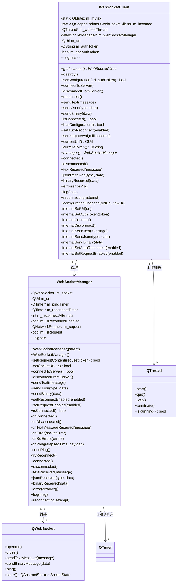
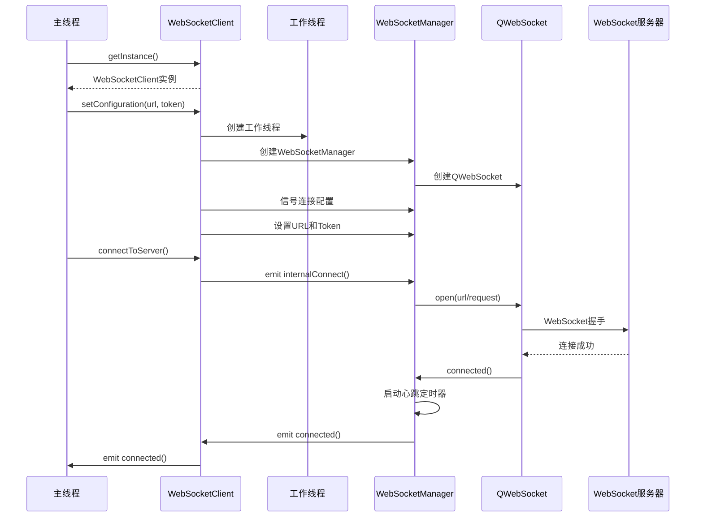
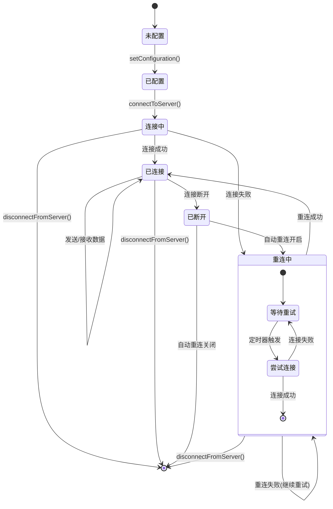
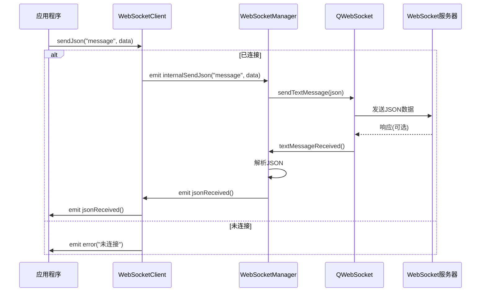
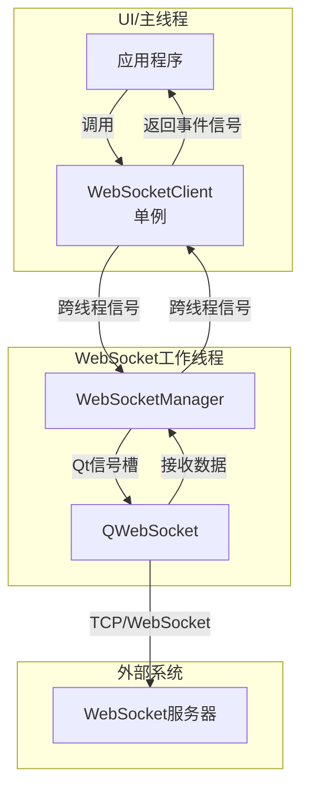

当前项目中实现了tcp, socket, websocket三种通信方式
项目只用到了了**websocket**方式，其他两种是历史遗留(Yosuga[Qt5]所使用)
并且websocket经过了重构，交互数据也为自定义格式

这边顺便提供下WebSocket类的Mermaid图，帮助理解(将代码丢给AI生成出来的图，审阅了一下还是十分准确的)

## 1. 类图 

## 2. 连接时序图 

## 3. 状态图 

## 4. 消息发送时序图 

## 5. 线程关系图 

